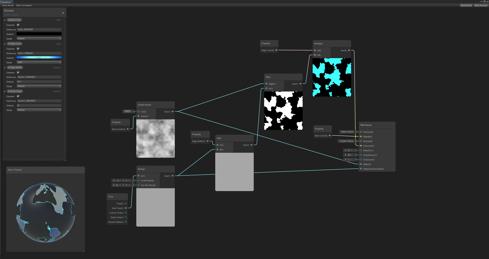

# Shader-Graph-Examples
Shaders made with ShaderGraph from various tutorials. Built with Unity 2019.

***Water Shader***

***Grass Shader***

***Dissolve Shader***

***Hologram Shader***

***Toon Shader***

***Ghost Shader***

